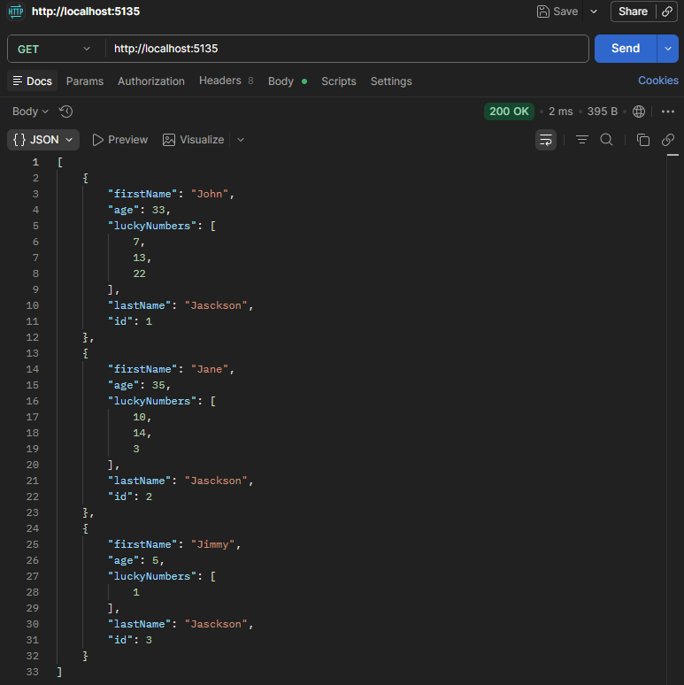
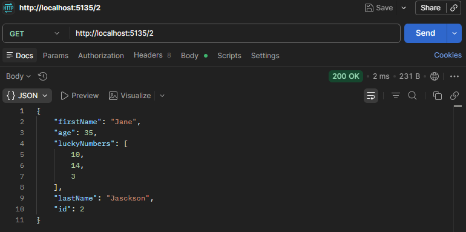
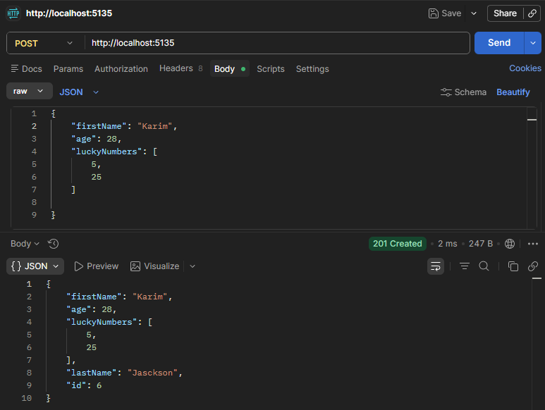
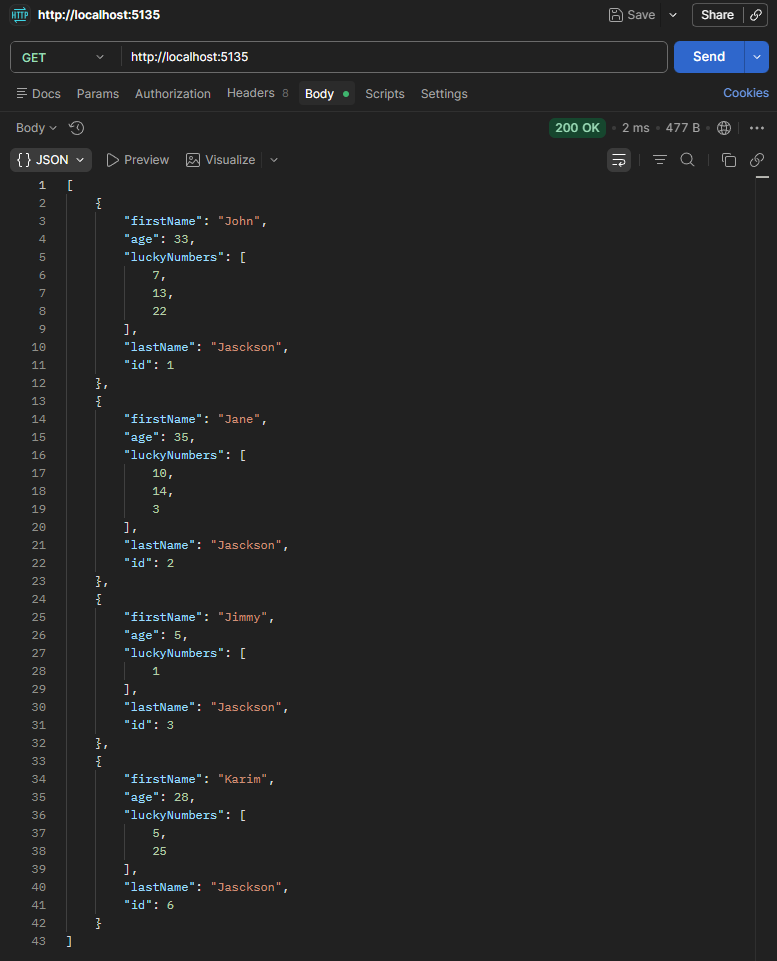

# ApiFamily

API REST minimalista en .NET 10 para gestionar miembros de una familia.

## Endpoints

| Método | Ruta   | Descripción                |
|--------|--------|----------------------------|
| GET    | `/`    | Obtener todos los miembros |
| GET    | `/{id}`| Obtener miembro por ID     |
| POST   | `/`    | Agregar nuevo miembro      |
| DELETE | `/{id}`| Eliminar miembro           |

## Screenshots

### GET /

### GET /{id}

### POST /

### GET / con nuevo miembro

